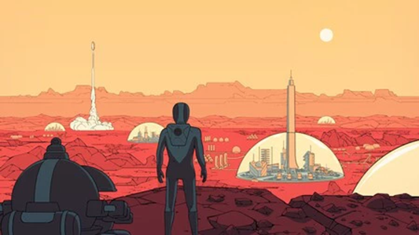
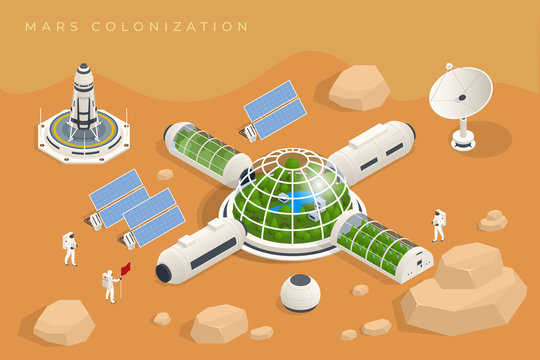

# Ecosistemas espaciales
##### Por Lucas Spigariol

Un grupo de colonos espaciales decidió crear una reserva natural en Marte para recrear varios hábitats de la Tierra en este planeta.

La reserva natural cuenta con diferentes hábitats, por ejemplo, llanura, bosque, desierto, cada uno con su propia fauna y flora. 

Tanto los animales como las plantas pertenecen a una especie que las identifica.
Las plantas, de las especies de flora, se caracterizan por tener una altura en metros y su biomasa es igual al doble de dicha altura, pero nunca más de la altura máxima de referencia de la especie. Actualmente está establecida en 10 la altura límite con la que se considera grande o pequeña una planta. 

De los los animales que son de las especies de fauna, se conoce cuánto pesan.  La biomasa de un animal se calcula como el peso al cuadrado sobre el coeficiente propio de su especie. Los animales pueden ser pequeños (si su peso es menor a la mitad del peso de referencia de su especie ), grandes (si pesan más del doble del peso de referencia de su especie) o medianos, en cualquier otro caso.  Además, se sabe la forma de locomoción propia de la especie: pueden volar (x ej golondrina), nadar (x ej delfín), correr (x ej hormiga) o quedarse siempre quietos (x ej mejillón).

Para conocer el estado actual de la reserva y de esa forma poder tomar decisiones de forma temprana ante cambios súbitos, se nos pidió poder determinar:

1.	Hábitat con mayor biomasa de la reserva. Tener en cuenta tanto la fauna como la flora de cada uno.
2.	Cantidad total de biomasa en la reserva, teniendo en cuenta todos los hábitats.
3.	Saber si el hábitat está en equilibrio. Esto es, cuando la cantidad de ejemplares grandes es menor a ⅓ de la cantidad de pequeños y además hay alguno mediano.
4.	Encontrar los hábitats de reserva que no están en equilibrio.
5.	Determinar si una especie dada está en todos los hábitats de la reserva.
6.	Hacer que se pueda producir un incendio en un hábitat. Como consecuencia, las plantas pequeñas se mueren mientras que las grandes disminuyen su tamaño en 5 unidades. Los animales sufren consecuencias según su modo de locomoción: los que vuelan y son grandes, se salvan, los que nadan siempre se salvan. Los que corren solo se salvan si son medianos. Los que están quietos, nunca se salvan. Además, todos los animales pierden peso (en un 10%).
Muy Importante: se deberá retirar del hábitat a todos los animales y plantas que hayan muerto por el incendio.
7.	Agregar algunos tests unitarios que prueben la funcionalidad pedida.

